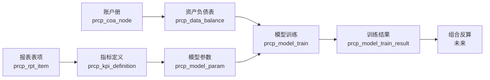

# PRCP 模型管理模块 — 技术架构与数据库设计

> **状态**: 设计稿 v1.0 | **日期**: 2026-09-17
> **模块代码**: `prcp_model_*` (5 张业务表) + `prcp_model_train_log` (训练日志)
> **关联模块**: 指标管理（KPI）、资产负债表（BalanceSheet）、账户册（COA）

---

## 一、业务概述

### 1.1 业务定位

模型管理是 PRCP **"数据 → 指标 → 模型 → 反算"** 链路的中间环节。承接：
- 上游：基础数据表（资产负债表）提供数据日期窗口
- 中游：指标管理提供 KPI 定义（公式已绑定报表表项）
- 下游：组合反算（未来开发）将模型输出作为反算的目标/约束

### 1.2 三大子功能

| 子功能 | 业务含义 | 类比 |
|---|---|---|
| **模型参数版本维护** | 同一类业务模型（如"对公存款增长模型"）的不同参数版本（v1/v2/v3） | git branch |
| **模型参数维护** | 每个版本下的具体参数（如 NIM=2.5%、不良率=1.5%），参数项指向 KPI 定义 | 配方 |
| **模型训练** | 用某参数版 + 某数据日期窗口，跑模型训练引擎，输出训练结果（预测值/拟合优度） | 模型 fit |

### 1.3 关键概念区分

```
模型（model）        = 业务标识，如"存款增长模型 DGM_2026"
  ├─ 参数版本（version） = 同一模型的不同参数配方，如 v1_保守 / v2_激进
  │    ├─ 参数明细（param） = 每个 KPI 关联的参数值
  │    │    ├─ param_code: K_NIM_001 (对公存款净息差)
  │    │    ├─ param_type: BASE / SCENARIO / STRESS
  │    │    └─ param_value: 2.5
  │    └─ 训练结果（train_result）= 用这组参数在 X 数据日期窗口跑出的预测
  └─ 数据日期窗口（balance_date_from/to）= 训练用的资产负债表日期区间
```

---

## 二、技术架构

### 2.1 后端模块结构

```
backend/app/
├── routers/
│   └── model.py           # ★ 新增: 5 个路由组，约 800 行
│       ├── 1. /model/versions         参数版本（list/create/update/delete/copy/import/export）
│       ├── 2. /model/params           参数明细（list/create/update/delete/import/export）
│       └── 3. /model/trains           训练任务（list/create/start/cancel/log/result/import/export）
└── services/
    ├── model_train_engine.py   # ★ 新增: 训练引擎（scipy/numpy/cvxpy 求解）
    └── model_value_calc.py     # ★ 新增: 训练结果查询 + 拟合优度计算
```

### 2.2 前端模块结构

```
frontend/src/pages/
└── ModelManage.tsx          # ★ 新增: 顶层页面，3 个 Tab
    ├── Tab 1: 参数版本维护（左侧版本列表 + 右侧版本详情）
    ├── Tab 2: 参数明细维护（左侧版本树 + 右侧参数列表 + 参数编辑 Modal）
    └── Tab 3: 模型训练（训练任务列表 + 启动训练 Modal + 训练日志 + 结果查看 Drawer）
```

### 2.3 与现有模块的集成关系



### 2.4 训练引擎算法设计

> **目标**：根据用户填写的参数值（关联 KPI 公式）和资产负债表数据窗口，求解模型的预测输出。

#### 2.4.1 通用求解流程

```python
def train(model_version_id: int, balance_date_from: str, balance_date_to: str) -> TrainResult:
    # 1. 加载参数
    params = load_model_params(model_version_id)         # 形如 [{kpi_code: 'NIM', value: 2.5, formula: '[001] * 1.1'}]

    # 2. 加载训练数据
    bal_data = load_balance_data(scheme_id, balance_date_from, balance_date_to)  # 24 个月现金流

    # 3. 按模型类型选算法
    algo = ALGO_REGISTRY[model_type]
    predicted, metrics = algo(params, bal_data)

    # 4. 落库 + 返回拟合优度
    save_train_result(predicted, metrics)
    return metrics  # {mae, rmse, r2}
```

#### 2.4.2 内置算法注册表

| model_type | 算法 | 用途 | 依赖 |
|---|---|---|---|
| `LINEAR_REGRESSION` | 普通最小二乘 | 资产规模预测 | numpy.linalg.lstsq |
| `LOGISTIC_GROWTH` | 逻辑斯蒂增长 | 存款增长率建模 | scipy.optimize.curve_fit |
| `ARIMA` | 自回归积分滑动平均 | 时间序列预测 | statsmodels |
| `MONTE_CARLO` | 蒙特卡洛模拟 | 不确定性分析（压力测试） | numpy.random |
| `LINEAR_PROGRAM` | 线性规划（cvxpy） | 资产负债结构优化 | cvxpy |

#### 2.4.3 训练执行模式

**异步模式**（推荐）：
- 前端点击「开始训练」→ 后端创建 `prcp_model_train` 记录（status=PENDING）
- 后台 worker（FastAPI BackgroundTasks 或 Celery）启动训练
- 前端轮询 `/trains/{id}` 获取状态（PENDING/RUNNING/SUCCESS/FAILED）
- 训练日志写入 `prcp_model_train_log`（每 5 秒追加一条）

**同步模式**（轻量训练 < 30 秒）：
- 直接返回 200 + 训练结果

---

## 三、数据库设计

### 3.1 ER 概览

```
┌─────────────────────────┐        ┌─────────────────────────┐
│ prcp_model              │ 1    * │ prcp_model_version      │
│  (模型主表 - 业务标识)    │───────│  (参数版本 - 配方)       │
└─────────────────────────┘        └────────┬────────────────┘
                                            │ 1
                                            │
                                            │ *
                                   ┌────────▼────────────────┐
                                   │ prcp_model_param        │
                                   │  (参数明细 - 引用 KPI)    │
                                   └─────────────────────────┘

┌─────────────────────────┐        ┌─────────────────────────┐
│ prcp_model_version      │ 1    * │ prcp_model_train        │
│                         │───────│  (训练任务 - 实例)        │
└─────────────────────────┘        └────────┬────────────────┘
                                            │ 1
                                            │
                                            │ *
                                   ┌────────▼────────────────────┐
                                   │ prcp_model_train_log        │
                                   │  (训练日志 - 实时进度)       │
                                   └─────────────────────────────┘

┌─────────────────────────┐
│ prcp_model_train        │ 1    1 │ prcp_model_train_result   │
│                         │───────│  (训练结果 - 预测值+指标)   │
└─────────────────────────┘        └─────────────────────────────┘
```

### 3.2 完整 DDL

#### 3.2.1 `prcp_model` — 模型主表

```sql
CREATE TABLE IF NOT EXISTS prcp_model (
  id              BIGINT AUTO_INCREMENT PRIMARY KEY,
  model_code      VARCHAR(32) NOT NULL UNIQUE,
  model_name      VARCHAR(128) NOT NULL,
  model_type      VARCHAR(32) NOT NULL DEFAULT 'LINEAR_REGRESSION',
                 -- 模型算法: LINEAR_REGRESSION / LOGISTIC_GROWTH / ARIMA / MONTE_CARLO / LINEAR_PROGRAM
  description     TEXT,
  algo_config     JSON,
                 -- 算法参数（如蒙特卡洛模拟次数 = 10000；置信水平 = 0.95）
  biz_domain      VARCHAR(32),
                 -- 业务域: DEPOSIT(存款) / LOAN(贷款) / NIM(净息差) / RWA(资本)
  status          VARCHAR(16) DEFAULT 'ACTIVE',  -- ACTIVE / DEPRECATED
  is_deleted      TINYINT(1) DEFAULT 0,
  created_by      BIGINT,
  updated_by      BIGINT,
  created_at      DATETIME DEFAULT CURRENT_TIMESTAMP,
  updated_at      DATETIME DEFAULT CURRENT_TIMESTAMP ON UPDATE CURRENT_TIMESTAMP,
  INDEX idx_type (model_type),
  INDEX idx_status (status)
) ENGINE=InnoDB DEFAULT CHARSET=utf8mb4 COMMENT='模型主表（业务标识）';
```

#### 3.2.2 `prcp_model_version` — 参数版本

```sql
CREATE TABLE IF NOT EXISTS prcp_model_version (
  id              BIGINT AUTO_INCREMENT PRIMARY KEY,
  model_id        BIGINT NOT NULL,                  -- 所属模型
  version_code    VARCHAR(32) NOT NULL,             -- 如 V1_BASELINE / V2_STRESS
  version_name    VARCHAR(128) NOT NULL,
  parent_version_id  BIGINT DEFAULT NULL,           -- 复制时记录父版本
  param_count     INT DEFAULT 0,                    -- 参数个数冗余字段
  description     TEXT,
  status          VARCHAR(16) DEFAULT 'DRAFT',
                 -- 状态机: DRAFT(草稿) / READY(就绪) / DEPRECATED(已弃用)
  is_deleted      TINYINT(1) DEFAULT 0,
  created_by      BIGINT,
  updated_by      BIGINT,
  created_at      DATETIME DEFAULT CURRENT_TIMESTAMP,
  updated_at      DATETIME DEFAULT CURRENT_TIMESTAMP ON UPDATE CURRENT_TIMESTAMP,
  UNIQUE KEY uk_model_version (model_id, version_code),
  INDEX idx_parent (parent_version_id),
  INDEX idx_status (status)
) ENGINE=InnoDB DEFAULT CHARSET=utf8mb4 COMMENT='模型参数版本';
```

#### 3.2.3 `prcp_model_param` — 参数明细

```sql
CREATE TABLE IF NOT EXISTS prcp_model_param (
  id              BIGINT AUTO_INCREMENT PRIMARY KEY,
  version_id      BIGINT NOT NULL,                  -- 所属版本
  kpi_id          BIGINT NOT NULL,                  -- 关联 prcp_kpi_definition.id
  kpi_code        VARCHAR(64),                      -- 冗余存储，便于查询（kpi_code 可变）
  param_code      VARCHAR(64) NOT NULL,             -- 参数编码（如 K_NIM_001_PAR）
  param_name      VARCHAR(128) NOT NULL,
  param_type      VARCHAR(16) DEFAULT 'BASE',
                 -- BASE(基准) / SCENARIO(情景) / STRESS(压力) / SENSITIVITY(敏感度)
  param_value     DECIMAL(20,6) NOT NULL,
  unit            VARCHAR(16),                      -- PERCENT / BP / YUAN
  formula         TEXT,                             -- 可选：参数自身的计算公式（覆盖 KPI 公式）
  formula_desc    TEXT,
  sort_order      INT DEFAULT 0,
  description     TEXT,
  is_deleted      TINYINT(1) DEFAULT 0,
  created_by      BIGINT,
  updated_by      BIGINT,
  created_at      DATETIME DEFAULT CURRENT_TIMESTAMP,
  updated_at      DATETIME DEFAULT CURRENT_TIMESTAMP ON UPDATE CURRENT_TIMESTAMP,
  UNIQUE KEY uk_version_param (version_id, param_code),
  INDEX idx_kpi (kpi_id),
  INDEX idx_version (version_id)
) ENGINE=InnoDB DEFAULT CHARSET=utf8mb4 COMMENT='模型参数明细（关联 KPI 定义）';
```

#### 3.2.4 `prcp_model_train` — 训练任务

```sql
CREATE TABLE IF NOT EXISTS prcp_model_train (
  id              BIGINT AUTO_INCREMENT PRIMARY KEY,
  train_code      VARCHAR(32) NOT NULL UNIQUE,      -- 自动生成，如 T20260917_001
  model_id        BIGINT NOT NULL,
  version_id      BIGINT NOT NULL,
  coa_scheme_id   BIGINT NOT NULL,                  -- 训练用的账户册方案
  balance_date_from  DATE NOT NULL,                 -- 训练窗口起点
  balance_date_to    DATE NOT NULL,                 -- 训练窗口终点
  status          VARCHAR(16) DEFAULT 'PENDING',
                 -- 状态机: PENDING / RUNNING / SUCCESS / FAILED / CANCELLED
  progress        DECIMAL(5,2) DEFAULT 0,           -- 训练进度 0-100
  start_at        DATETIME,
  end_at          DATETIME,
  duration_sec    INT,
                 -- 训练耗时（秒）
  metrics         JSON,
                 -- 训练结果指标 {mae, rmse, r2, mape}
  error_message   TEXT,                             -- 失败原因
  description     TEXT,
  is_deleted      TINYINT(1) DEFAULT 0,
  created_by      BIGINT,
  updated_by      BIGINT,
  created_at      DATETIME DEFAULT CURRENT_TIMESTAMP,
  updated_at      DATETIME DEFAULT CURRENT_TIMESTAMP ON UPDATE CURRENT_TIMESTAMP,
  INDEX idx_status (status),
  INDEX idx_model (model_id),
  INDEX idx_version (version_id),
  INDEX idx_dates (balance_date_from, balance_date_to)
) ENGINE=InnoDB DEFAULT CHARSET=utf8mb4 COMMENT='模型训练任务';
```

#### 3.2.5 `prcp_model_train_log` — 训练日志

```sql
CREATE TABLE IF NOT EXISTS prcp_model_train_log (
  id              BIGINT AUTO_INCREMENT PRIMARY KEY,
  train_id        BIGINT NOT NULL,
  log_level       VARCHAR(16) DEFAULT 'INFO',       -- DEBUG/INFO/WARN/ERROR
  log_message     TEXT NOT NULL,
  progress        DECIMAL(5,2),                     -- 该条日志对应的进度
  created_at      DATETIME DEFAULT CURRENT_TIMESTAMP,
  INDEX idx_train_time (train_id, created_at)
) ENGINE=InnoDB DEFAULT CHARSET=utf8mb4 COMMENT='模型训练日志（实时写入）';
```

#### 3.2.6 `prcp_model_train_result` — 训练结果（每期预测值）

```sql
CREATE TABLE IF NOT EXISTS prcp_model_train_result (
  id              BIGINT AUTO_INCREMENT PRIMARY KEY,
  train_id        BIGINT NOT NULL,
  rpt_item_id     BIGINT NOT NULL,                  -- 预测哪个报表表项
  rpt_item_code   VARCHAR(64),
  predict_period  DATE NOT NULL,                    -- 预测的月份
  predicted_value DECIMAL(20,6) NOT NULL,
  actual_value    DECIMAL(20,6),                    -- 实际值（如果有）
  confidence_low  DECIMAL(20,6),                    -- 置信下限
  confidence_high DECIMAL(20,6),                    -- 置信上限
  is_deleted      TINYINT(1) DEFAULT 0,
  created_at      DATETIME DEFAULT CURRENT_TIMESTAMP,
  UNIQUE KEY uk_train_item_period (train_id, rpt_item_id, predict_period),
  INDEX idx_train (train_id)
) ENGINE=InnoDB DEFAULT CHARSET=utf8mb4 COMMENT='模型训练结果（每期预测值）';
```

### 3.3 字段规范

| 字段 | 类型 | 说明 |
|---|---|---|
| `id` | `BIGINT AUTO_INCREMENT` | 主键 |
| `is_deleted` | `TINYINT(1) DEFAULT 0` | 软删标记 |
| `created_by` / `updated_by` | `BIGINT` | 操作人 ID（关联 sys_user.id） |
| `created_at` / `updated_at` | `DATETIME` | 自动维护 |
| `status` | `VARCHAR(16)` | 业务状态（ACTIVE/DRAFT/PENDING/RUNNING/SUCCESS/FAILED） |
| `description` | `TEXT` | 备注（统一必填字段） |

### 3.4 与现有表的关系

| 字段 | 引用 | 备注 |
|---|---|---|
| `prcp_model_version.model_id` | `prcp_model.id` | 多对一 |
| `prcp_model_param.kpi_id` | `prcp_kpi_definition.id` | 关联 KPI 定义，**参数 = KPI 的实例化** |
| `prcp_model_train.version_id` | `prcp_model_version.id` | 训练实例化哪个版本 |
| `prcp_model_train.coa_scheme_id` | `prcp_coa_scheme.id` | 训练用的账户册 |
| `prcp_model_train_result.rpt_item_id` | `prcp_rpt_item.id` | 预测的报表表项 |

---

## 四、API 设计

### 4.1 模型版本 API

```
GET    /prcp/api/model/versions              列出某模型的所有版本（含过滤）
POST   /prcp/api/model/versions              新建版本
PUT    /prcp/api/model/versions/{vid}        修改版本
DELETE /prcp/api/model/versions/{vid}        删除版本（级联删除参数 + 训练）
POST   /prcp/api/model/versions/{vid}/copy   复制版本（生成新版本，记录 parent_version_id）
GET    /prcp/api/model/versions/export       导出（Excel）
POST   /prcp/api/model/versions/import       导入（Excel）
```

### 4.2 模型参数 API

```
GET    /prcp/api/model/params?version_id=X   列出某版本的参数
POST   /prcp/api/model/params                新增参数（关联 KPI）
PUT    /prcp/api/model/params/{pid}          修改参数
DELETE /prcp/api/model/params/{pid}          删除参数
GET    /prcp/api/model/params/{pid}/kpi-preview   KPI 计算预览
POST   /prcp/api/model/params/import         导入
GET    /prcp/api/model/params/export         导出
```

### 4.3 模型训练 API

```
GET    /prcp/api/model/trains                训练任务列表
POST   /prcp/api/model/trains                新建训练任务（不立即执行）
POST   /prcp/api/model/trains/{tid}/start    开始训练（异步）
POST   /prcp/api/model/trains/{tid}/cancel   取消训练
DELETE /prcp/api/model/trains/{tid}          删除
GET    /prcp/api/model/trains/{tid}/logs     训练日志（SSE 流式 或 轮询）
GET    /prcp/api/model/trains/{tid}/result   训练结果（预测值）
GET    /prcp/api/model/trains/export         导出训练结果
```

### 4.4 模型主表 API

```
GET    /prcp/api/model/models                模型列表
POST   /prcp/api/model/models                新建模型
PUT    /prcp/api/model/models/{mid}          修改模型
DELETE /prcp/api/model/models/{mid}          删除模型（级联）
GET    /prcp/api/model/algorithms            算法列表（给前端下拉）
```

---

## 五、训练引擎核心代码草图

```python
# backend/app/services/model_train_engine.py
import asyncio
import time
from datetime import datetime
from sqlalchemy import text
from sqlalchemy.orm import Session
import numpy as np

ALGO_REGISTRY = {
    "LINEAR_REGRESSION": _train_linear_regression,
    "LOGISTIC_GROWTH":   _train_logistic_growth,
    "MONTE_CARLO":       _train_monte_carlo,
    "LINEAR_PROGRAM":    _train_linear_program,
    # ARIMA / XGBoost 等可后续注册
}

async def run_train(train_id: int, db_factory):
    """主训练协程（被 BackgroundTasks 调用）"""
    db: Session = db_factory()
    try:
        # 1. 加载训练上下文
        train = db.execute(text("SELECT * FROM prcp_model_train WHERE id=:id"),
                            {"id": train_id}).first()
        _log(db, train_id, "INFO", f"训练开始: {train.model_name}", 0)
        _update_status(db, train_id, "RUNNING", 0)

        # 2. 加载参数（已 JOIN KPI 定义）
        params = _load_params(db, train.version_id)

        # 3. 加载资产负债表数据（窗口内）
        bal = _load_balance(db, train.coa_scheme_id,
                            train.balance_date_from, train.balance_date_to)

        # 4. 选算法 + 执行
        algo_fn = ALGO_REGISTRY[train.model_type]
        predicted, metrics = algo_fn(params, bal, log_fn=lambda msg, p:
                                     _log(db, train_id, "INFO", msg, p))

        # 5. 落库
        _save_results(db, train_id, predicted)
        _update_status(db, train_id, "SUCCESS", 100, metrics=metrics)
        _log(db, train_id, "INFO", f"训练完成: MAE={metrics['mae']:.4f}", 100)

    except Exception as e:
        _update_status(db, train_id, "FAILED", 0, error=str(e))
        _log(db, train_id, "ERROR", f"训练失败: {e}", 0)
    finally:
        db.close()


def _train_linear_regression(params, bal, log_fn):
    """最小二乘拟合示例"""
    log_fn("加载参数与数据...", 10)
    X = bal["x"]    # 时间序列 X
    y = bal["y"]    # 实际值 y
    log_fn("开始最小二乘拟合...", 30)
    coef, *_ = np.linalg.lstsq(X, y, rcond=None)
    log_fn("拟合完成，计算预测...", 70)
    predicted = X @ coef
    metrics = {
        "mae": float(np.mean(np.abs(predicted - y))),
        "rmse": float(np.sqrt(np.mean((predicted - y) ** 2))),
        "r2": float(1 - np.sum((y - predicted) ** 2) / np.sum((y - y.mean()) ** 2)),
    }
    return predicted, metrics
```

---

## 六、前端页面设计

详见 `docs/模型管理模块_页面原型.html`（单独 HTML 文件，用 AntD 风格 mockup 展示 3 个 Tab）。

---

## 七、初始化脚本设计

```sql
-- upgrade_model.sql
-- 1. 创建 5 张业务表
-- 2. 插入示例模型
INSERT INTO prcp_model (model_code, model_name, model_type, biz_domain, description)
VALUES
('DGM_2026', '存款增长模型', 'LINEAR_REGRESSION', 'DEPOSIT', '示例：基于历史数据预测存款规模'),
('NIM_2026', '净息差预测模型', 'ARIMA', 'NIM', '示例：NIM 时间序列预测'),
('RWA_2026', '资本充足率优化模型', 'LINEAR_PROGRAM', 'RWA', '示例：基于 cvxpy 的资产结构优化');

-- 3. 插入示例版本（每个模型一个 V1_BASELINE）
-- 4. 插入示例参数（关联 KPI 定义）
```

---

## 八、部署清单

- [ ] `backend/app/routers/model.py`（约 800 行）
- [ ] `backend/app/services/model_train_engine.py`（约 250 行）
- [ ] `backend/app/services/model_value_calc.py`（约 150 行）
- [ ] `backend/scripts/upgrade_model.sql`（DDL + 种子数据）
- [ ] `frontend/src/pages/ModelManage.tsx`（约 900 行）
- [ ] `frontend/src/api/index.ts` 新增 `modelApi`
- [ ] `frontend/src/MainLayout.tsx` 加菜单项 `/model`
- [ ] `backend/app/main.py` 注册路由
- [ ] 测试：5 个核心场景（增/删/改/复制/训练）
- [ ] 部署 + 验证

---

**文档版本**: v1.0 | **作者**: WorkBuddy | **最后更新**: 2026-09-17